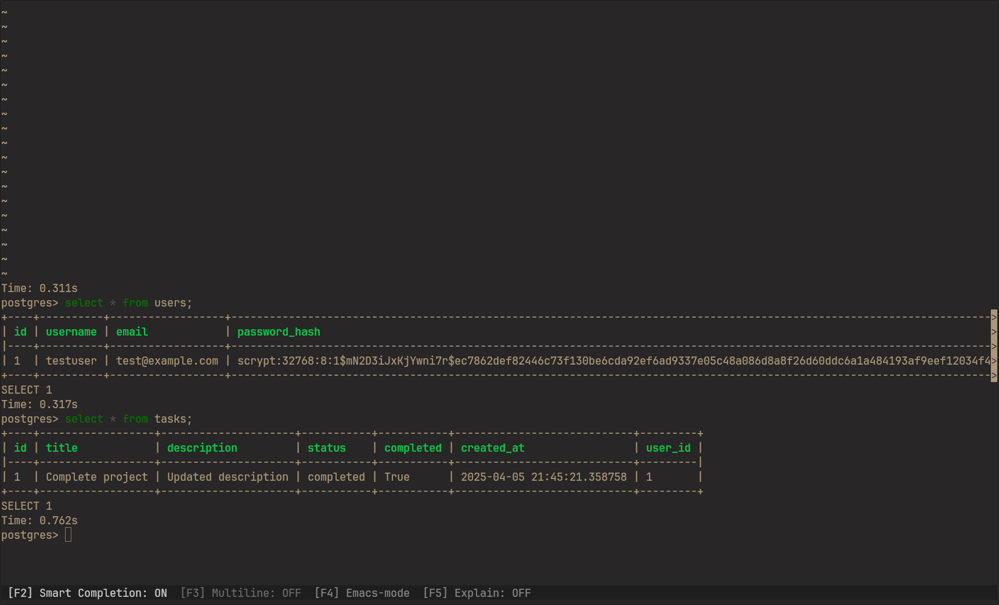

# BusinessHero Tasks

[Live Demo](https://businesshero-tasks.onrender.com/)

This will take some time to start, because of free plan on render.



A Flask backend with PostgreSQL integration. Example application for a task dashboard.

## Setup

1. Make sure you have Python 3.13+ installed
2. I have used [uv](https://github.com/astral-sh/uv) here, its really good, should use this for dependency management.
3. Install dependencies:

   ```
   uv sync
   ```

4. Set up environment variables:

   - Create a `.env` file in the root directory (use `.env.example` as a reference)
   - Update the PostgreSQL connection details

5. Run the application:
   ```
   uv run asgi.py
   ```

## Migrations

If you change anything in db models, make sure to create a migration:

```
uv run flask db migrate -m "your migration message"
```

To apply the migrations:

```
uv run flask db upgrade
```

## Docker

To run the application using Docker:

1. Build the Docker image:

   ```
   docker build -t businesshero-tasks .
   ```

2. Run the container with environment variables:

   ```
   docker run -p 5000:5000 --env-file .env businesshero-tasks
   ```

## Deployment on Render

- Fork the project
- Go to render dashboard
- Click on new -> web service
- Choose the Repository
- Add the environmental variables from .env file
- Deploy, sit back and relax!

> I have deployed the database using tembo cloud. It's free to use, so I used it for development as well.

## Requirements

- Python 3.13+
- PostgreSQL
- `uv` package manager
